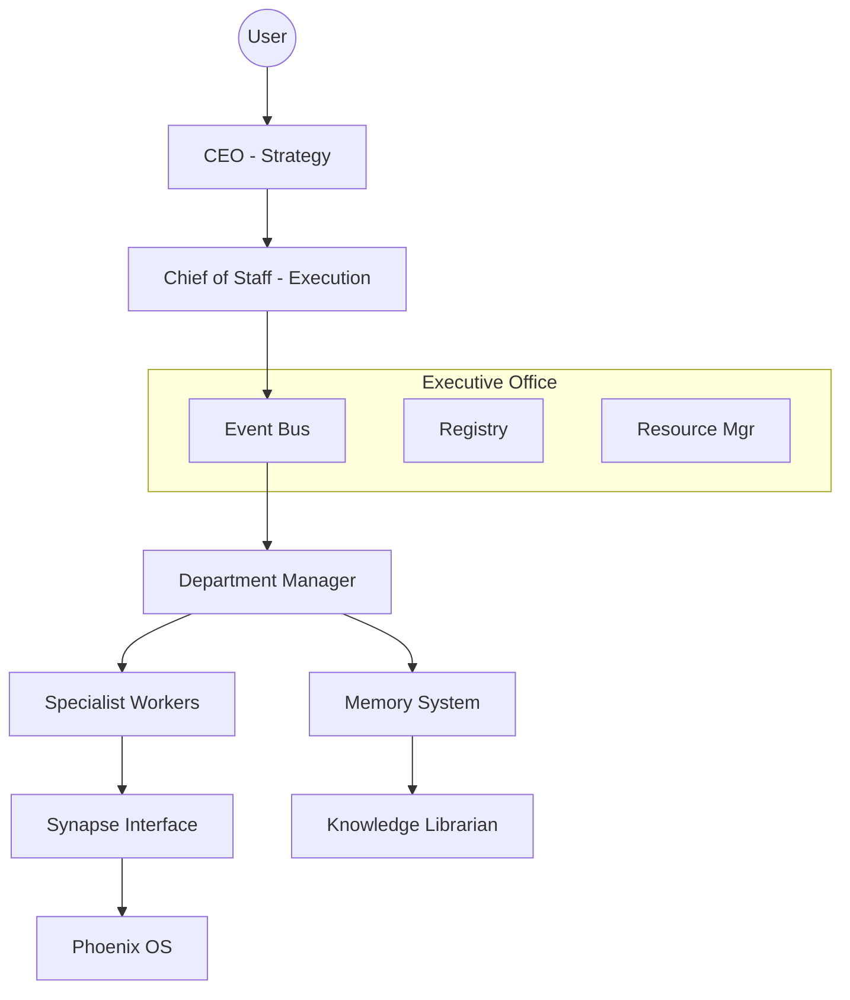

# JARVIS Cognitive Engine V2 Architecture

## 1. High-Level Overview
JARVIS V2 is a multi-layered, event-driven cognitive platform designed for Phoenix OS. It separates high-level strategy (CEO) from operational execution (Chief of Staff) and specialized task performance (Departments/Workers).

### Key Layers:
1. **Executive Layer (CEO & Chief of Staff)**: Strategic intent and operational orchestration.
2. **Infrastructure Layer (Executive Office)**: Shared services like the Event Bus, Registries, and Hardware Management.
3. **Departmental Layer**: Independent specialist units (Research, Coding, etc.) following the Manager-Worker pattern.
4. **Bridge Layer (Synapse)**: Deterministic, secure interface to Phoenix OS.

## 2. Core Components

### CEO (Chief Executive Officer)
- Understands user intent and determines high-level goals.
- Assigns goals to the Chief of Staff.
- Reviews results and makes final executive decisions.

### Chief of Staff
- Schedules departments and manages priorities.
- Monitors progress and handles interruptions.
- Resolves conflicts between departments.

### Executive Office
- **Event Bus**: The nervous system. All communication is structured and event-driven.
- **Registries**: Dynamic discovery of departments and capabilities.
- **Resource Allocation**: Manages CPU/RAM/Token budgets.

### Departments
- **Manager**: Receives requests from the Executive Office, plans work, and assigns workers.
- **Workers**: Perform specialized tasks (e.g., Python Worker, Search Worker).

### Memory System & Knowledge Librarian
- **Tiered Memory**: Working, Episodic, Semantic, Procedural.
- **Librarian**: Ensures knowledge quality, deduplication, and contradiction detection.

### Synapse Interface
- The exclusive, deterministic gateway to the OS. No direct shell/filesystem calls from LLMs.

## 3. Communication Protocol
All communication uses structured `Task` and `Event` objects.
- **Task**: Includes UUID, Creator, Department, Priority, Status, Dependencies, Budget.
- **Event**: Standardized types like `UserIntentReceived`, `TaskCompleted`, `SecurityApproved`.

## 4. Mermaid Diagram (Internal Reference)

