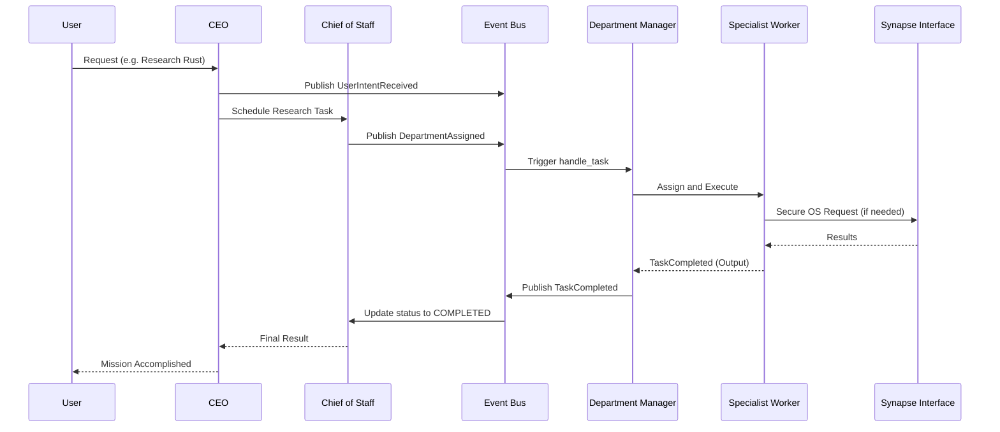

# Cognitive Engine V2 Directory Structure

```text
src/
├── core/                   # Executive Office & Shared Infrastructure
│   ├── models.py           # Structured Task, Event, and Memory models
│   ├── interfaces.py       # Stable Protocols for all components
│   ├── event_bus.py        # Central Event-Driven system
│   ├── registry.py         # Dynamic Discovery (Departments/Capabilities)
│   ├── hardware.py         # Hardware Auto-detection & Optimization
│   ├── model_manager.py    # Multi-model selection logic
│   └── security.py         # Deterministic Security Enforcement
├── executive/              # Strategy & Operational Management
│   ├── ceo.py              # Strategic Intent & Goal Setting
│   └── chief_of_staff.py   # Task Scheduling & Priority Monitoring
├── departments/            # Independent Specialist Units
│   ├── base.py             # Department/Manager/Worker frameworks
│   ├── research.py         # Research Department implementation
│   └── coding.py           # Coding Department implementation
├── memory/                 # Multi-tier Knowledge Management
│   ├── tiered_memory.py    # Working, Episodic, Semantic tiers
│   └── librarian.py        # Knowledge Quality & Consolidation
├── bridge/                 # OS Abstraction
│   └── synapse.py          # Secure gateway to Phoenix OS
└── v2_main.py              # System Entry Point & Orchestration
```

## Execution
To run the JARVIS V2 Cognitive Engine, use the following commands from the project root:

### CLI Mode
```bash
python3 src/main.py
```

### Web Dashboard
Select option `[3]` after running the CLI command above, or run directly:
```bash
python3 -m uvicorn src.api:app --host 0.0.0.0 --port 8000
```

### Direct Framework Test
```bash
python3 src/v2_main.py
```

### Diagnostics
```bash
python3 src/v2_diagnostics.py
```

## System Workflow Diagram (Mermaid)


